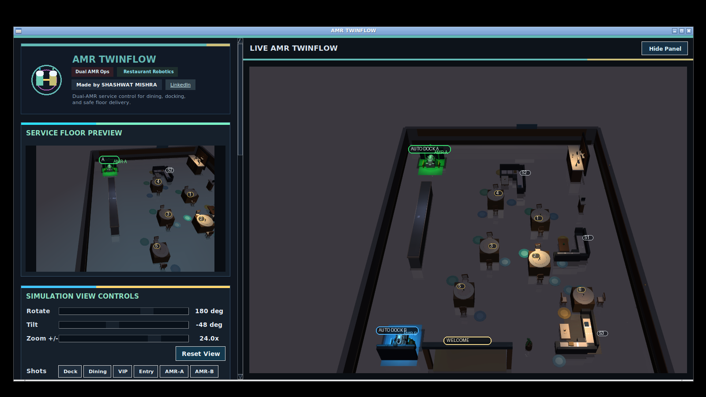
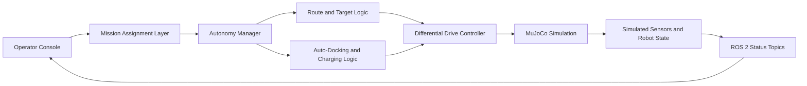
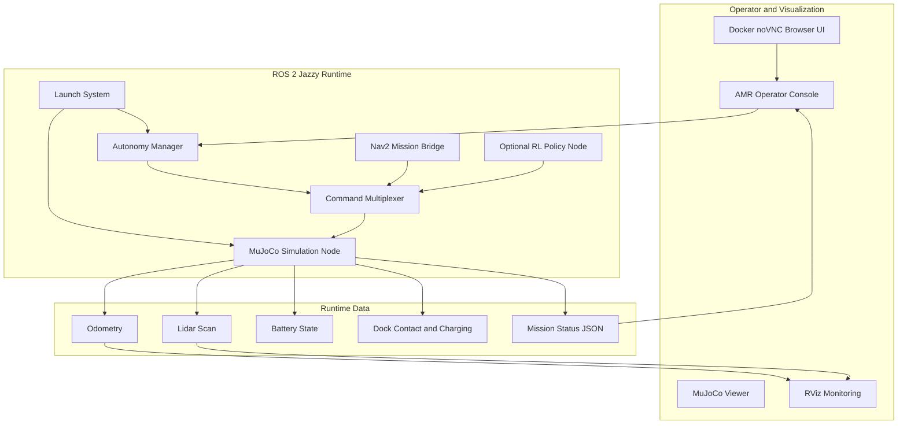
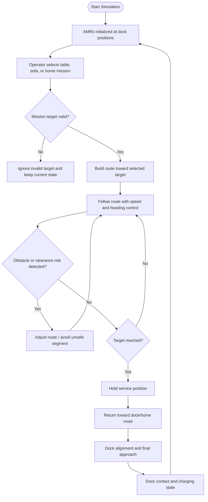
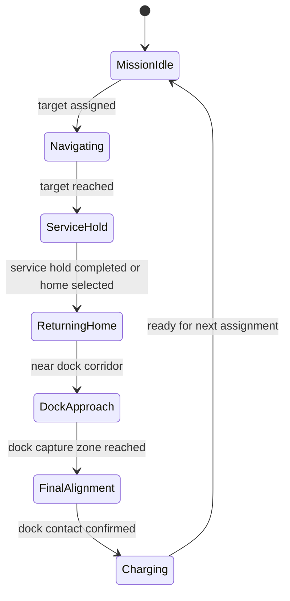

# AMR MuJoCo Simulator

Professional dual-AMR simulation built with MuJoCo and ROS 2 Jazzy. The project demonstrates autonomous mobile robot behavior in a structured indoor service environment with target assignment, route execution, obstacle-aware navigation behavior, auto-docking, charging state reporting, operator controls, and Docker-based browser access.


## Demo Video

Watch the project demonstration on YouTube: [https://youtu.be/6bRikWp0-1Q?si=UoeBDqzCrAG4zsc0](https://youtu.be/6bRikWp0-1Q?si=UoeBDqzCrAG4zsc0)

## Live Simulation Screenshot



## Key Highlights

- MuJoCo physics-based simulation environment.
- ROS 2 Jazzy package with launch files, nodes, services, topics, and runtime status publishing.
- Dual-AMR operation with separate start/dock positions.
- Operator console for mission dispatch and monitoring.
- Table and sofa target assignment workflow.
- Obstacle-aware route following with clearance-focused path planning logic.
- Auto-docking and charging state reporting.
- Browser-based Docker deployment through noVNC.
- RViz configuration and ROS monitoring support.
- Verification scripts for service-target mission testing.

## Demo Targets

AMR service missions are organized around named targets that can be assigned by the operator.

| Category | Targets |
| --- | --- |
| Tables | `table_1`, `table_2`, `table_3`, `table_4`, `table_5`, `table_6` |
| Sofas | `sofa_1`, `sofa_2`, `sofa_3` |
| Docking | home / auto-docking workflow |

## Figure 1: System Block Diagram



## Figure 2: Runtime Architecture



## Figure 3: Mission Flow Chart



## Figure 4: Auto-Docking Logic



## Repository Structure

```text
.
|-- Dockerfile
|-- docker/
|   |-- entrypoint.sh
|   |-- healthcheck.py
|   `-- amr-favicon.svg
|-- src/mujoco_amr_sim/
|   |-- config/              # Dock, waypoint, EKF, SLAM, and Nav2 configuration
|   |-- docs/                # Operator and RL documentation assets
|   |-- launch/              # ROS 2 launch files
|   |-- models/              # Simulation mesh assets
|   |-- mujoco_amr_sim/      # Python ROS 2 nodes and simulation logic
|   |-- rviz/                # RViz layouts
|   |-- test/                # Unit tests
|   `-- urdf/                # Robot description
|-- tools/                  # Mission verification and snapshot utilities
|-- verify_service_target.sh
`-- verify_service_matrix.sh
```

## Core Components

| Component | Purpose |
| --- | --- |
| `sim_node.py` | MuJoCo simulation runtime, viewer integration, robot state publishing, operator UI, and simulated environment behavior. |
| `autonomy_manager.py` | Mission state machine, service target workflow, docking decisions, and autonomy status reporting. |
| `config_utils.py` | Route, waypoint, dock, and service-target helper logic. |
| `controllers.py` | Motion-control helpers used by the simulated AMR behavior. |
| `mjcf_builder.py` | Procedural MuJoCo scene and robot/environment construction. |
| `command_mux.py` | Command source arbitration between autonomous, manual, and optional policy-driven control. |
| `nav2_mission_bridge.py` | Bridge layer for Nav2-oriented mission integration. |
| `rl_policy_node.py` / `rl_env.py` | Optional reinforcement-learning control interface. |

## ROS 2 Topics

Representative topics published or consumed by the simulation:

| Topic | Purpose |
| --- | --- |
| `/cmd_vel` | Final velocity command sent to the simulated AMR. |
| `/cmd_vel_auto` | Autonomous velocity command path. |
| `/cmd_vel_manual` | Manual override command path. |
| `/odom` | Odometry output. |
| `/scan` | Simulated lidar scan output. |
| `/battery_state` | Battery state reporting. |
| `/dock/in_contact` | Dock contact signal. |
| `/dock/is_charging` | Charging state signal. |
| `/autonomy/mission_command` | Mission command input. |
| `/autonomy/mission_status` | Mission state and robot status. |
| `/simulation/status` | Runtime simulation status payload. |
| `/simulation/event_log` | Runtime event stream. |

## ROS 2 Services

| Service | Purpose |
| --- | --- |
| `/autonomy/force_dock` | Request dock return. |
| `/autonomy/resume_patrol` | Resume autonomous behavior. |
| `/autonomy/reload_mission` | Reload mission configuration. |
| `/autonomy/skip_waypoint` | Skip current route waypoint. |
| `/safety/set_emergency_stop` | Enable or clear emergency stop. |
| `/safety/clear_commands` | Clear pending safety/command state. |

## Local Setup

The project targets ROS 2 Jazzy on Ubuntu/WSL or Linux.

```bash
cd ros2_ws
source /opt/ros/jazzy/setup.bash
colcon build --symlink-install --packages-select mujoco_amr_sim
source install/setup.bash
```

Launch the full simulation:

```bash
ros2 launch mujoco_amr_sim full_stack.launch.py use_viewer:=true
```

Launch without the MuJoCo viewer window:

```bash
ros2 launch mujoco_amr_sim full_stack.launch.py use_viewer:=false show_overview_window:=false
```

## Docker Deployment

Build the image:

```bash
docker build -t mujoco-amr-sim:latest .
```

Run the container:

```bash
docker run -d --name mujoco-amr-sim-container --restart unless-stopped -p 6080:6080 mujoco-amr-sim:latest
```

Open the browser UI:

```text
http://localhost:6080
```

The Docker image starts a browser-accessible noVNC session for the MuJoCo/ROS simulation environment.

Docker Hub image:

```bash
docker pull shashwatmishra062/mujoco-amr-sim:latest
```

## Mission Commands

Send a target command directly through ROS 2:

```bash
ros2 topic pub --once /autonomy/mission_command std_msgs/msg/String "{data: table_1}"
```

Examples:

```bash
ros2 topic pub --once /autonomy/mission_command std_msgs/msg/String "{data: table_6}"
ros2 topic pub --once /autonomy/mission_command std_msgs/msg/String "{data: sofa_2}"
```

Request docking:

```bash
ros2 service call /autonomy/force_dock std_srvs/srv/Trigger
```

Monitor runtime status:

```bash
ros2 topic echo /autonomy/mission_status
ros2 topic echo /simulation/status
```

## Verification

Run focused unit tests:

```bash
PYTHONPATH=src/mujoco_amr_sim python3 -m pytest \
  src/mujoco_amr_sim/test/test_controllers.py \
  src/mujoco_amr_sim/test/test_config_utils.py -q
```

Run a single service-target verification:

```bash
bash verify_service_target.sh a table_1 320
```

Run a matrix verification:

```bash
bash verify_service_matrix.sh 320 .verify_logs/matrix_a a
```

## Practical Scope

This is a simulation project for AMR autonomy demonstration and robotics system integration. It is not a claim of physical robot certification, certified safety validation, or production deployment on real hardware. Real-world deployment would require hardware drivers, safety-rated sensing, validated localization, field testing, and site-specific commissioning.

## Author

Shashwat Mishra

- LinkedIn: <https://www.linkedin.com/in/sm980/>
- Docker Hub: <https://hub.docker.com/r/shashwatmishra062/mujoco-amr-sim>
